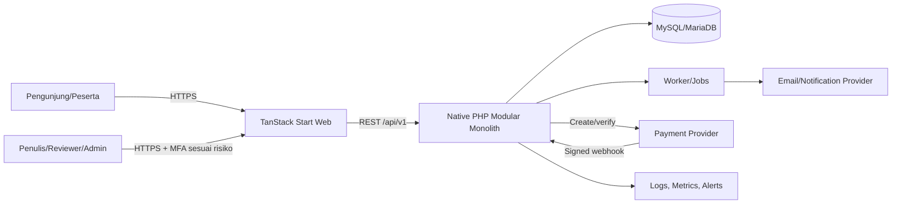
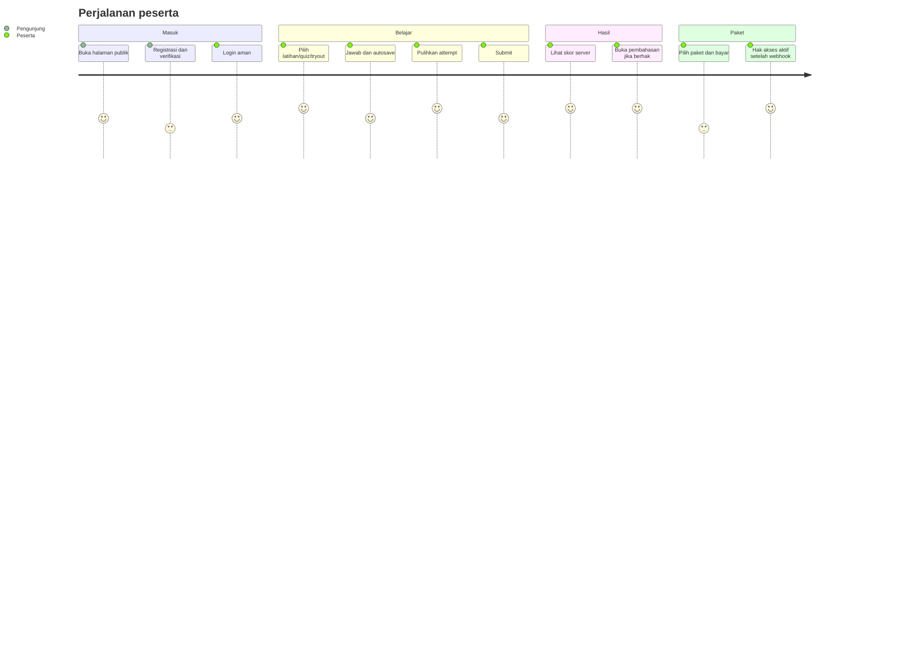
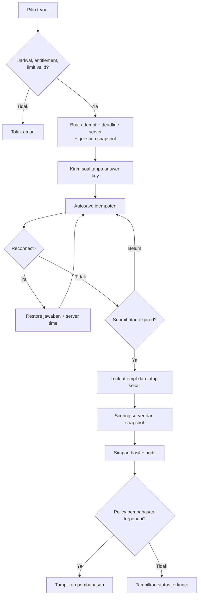
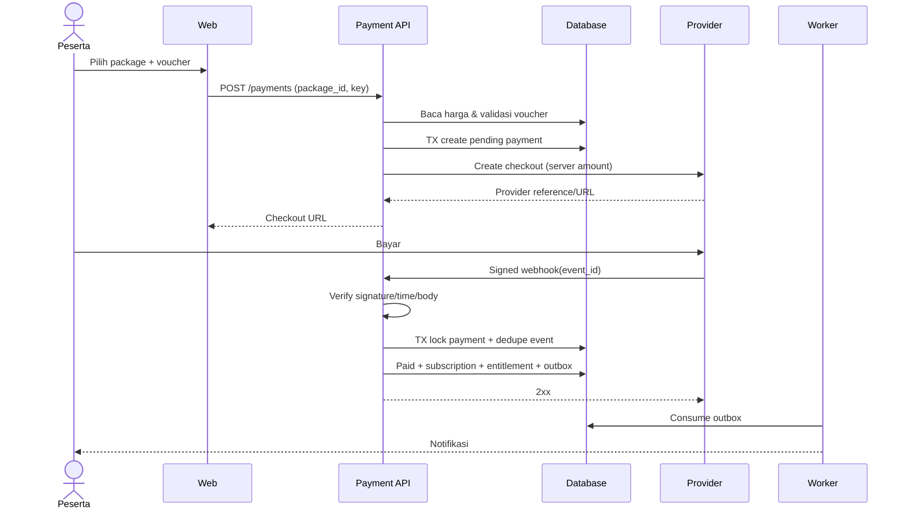
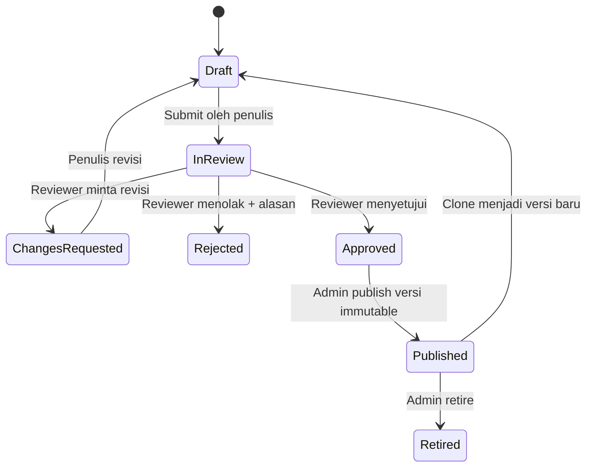
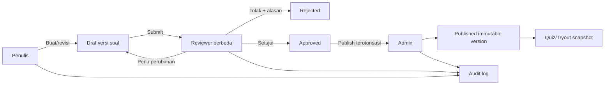
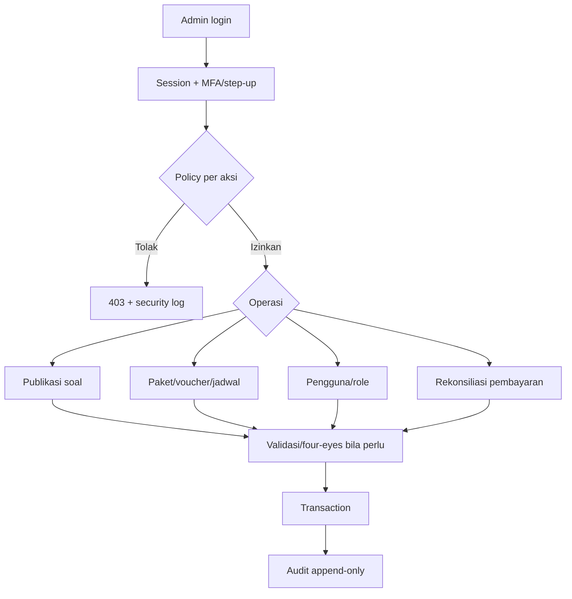

# Ikhtisar Sistem SINAESTA

**Status:** Baseline arsitektur
**Tanggal:** 6 Agustus 2026

> PRD saat ini masih berstatus draf dan menyatakan domain belum dikonfirmasi.
> Dokumen ini memakai arahan proyek pembelajaran pada prompt sebagai baseline
> teknis. Ketidaksesuaian harus diselesaikan dengan memperbarui dan menyetujui PRD
> sebelum implementasi bisnis, sesuai documentation gate PRD.

## 1. Tujuan, pengguna, dan modul

SINAESTA adalah platform web pembelajaran yang memungkinkan peserta berlatih soal,
mengikuti quiz dan tryout bertimer, memperoleh skor serta pembahasan sesuai hak
akses, dan membeli paket. Sistem membantu tim konten menyusun, mereview,
mempublikasikan, serta mengaudit soal dan membantu operator menangani paket,
pembayaran, voucher, pengguna, dan kesehatan layanan.

| Pengguna | Kebutuhan utama |
| --- | --- |
| Pengunjung | Melihat halaman publik, paket, lalu registrasi/login |
| Peserta | Mengelola profil, berlatih, quiz/tryout, hasil, pembahasan, paket |
| Penulis soal | Membuat versi draf soal dan mengajukan review |
| Reviewer | Memeriksa substansi, meminta revisi, menyetujui/menolak |
| Administrator/operator | Publikasi, katalog, voucher, pembayaran, pengguna, audit |
| Sistem eksternal | Payment provider mengirim webhook yang ditandatangani |

Modul bisnis adalah Identity, Profile, QuestionBank, Practice, Quiz, Tryout,
Attempt, Scoring, Analytics, Subscription, Entitlement, Payment, Voucher,
Notification, Administration, Audit, dan SystemHealth. Kepemilikan teknis tiap
modul dijelaskan dalam `02-architecture.md`.

## 2. Batas sistem dan dependensi eksternal

**Di dalam batas SINAESTA:** frontend TanStack Start, native PHP REST API, aturan
authorization/scoring/timer/entitlement/payment, worker, MySQL/MariaDB, audit log,
dan adapter integrasi. **Di luar batas:** browser/perangkat pengguna, payment
provider, pengirim email/notifikasi, DNS/CDN/WAF, object storage/backup, serta
platform observability. Provider adalah sumber kejadian transaksi, tetapi status
yang boleh dilihat aplikasi baru berubah setelah backend memverifikasi webhook.

SINAESTA tidak menjamin konektivitas pengguna atau uptime provider. Sistem tidak
menyimpan data kartu; halaman/SDK provider menangani instrumen pembayaran. Email
tidak menjadi bukti pembayaran atau entitlement.

## 3. Data utama

Data utama meliputi user, credential hash, opaque session hash, profile dan
timezone; question, option, tag, question version/snapshot, review dan publication;
practice/quiz/tryout definition; attempt, server deadline, answer revision,
submission, score dan result; package, subscription, entitlement dan expiry;
payment, payment event, idempotency key, voucher/redemption; notification; serta
immutable audit event. Semua waktu persisten UTC, public ID berupa UUID/ULID, uang
berupa integer unit terkecil/`DECIMAL`, dan retensi mengikuti kebijakan privasi.

## 4. Alur identitas dan perjalanan peserta

### Registrasi

1. Pengunjung mengirim email, password, persetujuan wajib, dan idempotency key.
2. Backend menormalkan email, memvalidasi server-side, mengecek duplikasi, meng-hash
   password dengan algoritma kuat, lalu membuat user/profile dalam transaksi.
3. Sistem mengirim verifikasi melalui job; respons tidak membocorkan keberadaan
   akun. Setelah token sekali pakai yang di-hash diverifikasi, akun diaktifkan dan
   aksi diaudit.

### Login

Backend melakukan rate limit, mencari credential secara aman, memverifikasi hash,
dan mencatat kegagalan tanpa password. Jika valid, backend merotasi session,
menyimpan hanya hash opaque token, mengirim cookie `HttpOnly`, `Secure`, `SameSite`,
dan mengaudit login. Setiap request memvalidasi session, expiry, CSRF untuk operasi
cookie yang mengubah state, serta authorization resource.

### Latihan soal

Peserta memilih topik. Backend memeriksa entitlement, memilih published question
version, membuat attempt/snapshot, lalu mengirim soal tanpa jawaban benar. Jawaban
disimpan; mode latihan dapat men-submit per butir atau sesi sesuai definisi.
Backend menghitung hasil. Pembahasan hanya dikirim setelah aturan unlock terpenuhi.

### Quiz

Peserta memilih quiz. Backend memeriksa jadwal/hak, membuat attempt dari snapshot
versi quiz, dan mengembalikan urutan soal. Autosave dan submit mengikuti aturan
attempt. Scoring final sepenuhnya di server; hasil/pembahasan mengikuti kebijakan
quiz.

### Tryout

Backend memeriksa enrollment, jadwal, entitlement, attempt limit, lalu menyimpan
`started_at` dan `expires_at` berbasis waktu server serta question snapshot. Klien
menampilkan countdown informatif dari deadline server. Saat deadline tercapai,
request berikutnya atau scheduled job melakukan auto-submit idempoten. Attempt
yang telah submitted/expired tidak dapat diubah.

## 5. Siklus attempt, autosave, submit, scoring, dan pembahasan

### Autosave dan restore

Klien mengirim `attempt_id`, `question_id`, jawaban, nomor revisi, dan idempotency
key. Backend memvalidasi pemilik, status aktif, snapshot, serta deadline server.
Dalam transaksi, backend menyimpan revisi terbaru secara idempoten dan
mengembalikan revision/server time. Konflik revisi menghasilkan 409. Restore
mengambil jawaban tersimpan, status, `expires_at`, dan server time; tidak pernah
mengirim jawaban benar selama attempt aktif.

### Submit dan auto-submit

Submit mengunci row attempt (`SELECT ... FOR UPDATE`), menguji kepemilikan dan
state, menutup attempt sekali saja, mengambil snapshot dan jawaban, lalu memanggil
Scoring dalam transaksi yang konsisten. Retry mengembalikan hasil yang sama. Job
expiry memakai mekanisme sama dengan alasan `expired`, sehingga timer browser
tidak dipercaya dan submit manual tidak berlomba dengan auto-submit.

### Scoring dan pembahasan

Scoring membaca answer key/rubric dari snapshot yang tidak pernah dikirim saat
aktif, menghitung komponen dan skor final, menyimpan versi algoritma serta audit,
kemudian menerbitkan event. Frontend hanya memformat hasil. Pembahasan dibuka oleh
policy backend—misalnya setelah submit, jadwal pengumuman, dan entitlement valid—
dan aksesnya dicatat.

## 6. Pembelian paket dan pembayaran

Peserta memilih `package_id`; backend mengambil harga aktif dari database,
memvalidasi voucher server-side, dan membuat payment pending/idempotency key dalam
transaksi. Backend meminta checkout ke provider menggunakan jumlah hasil hitungnya,
bukan nilai klien. Browser diarahkan ke provider; redirect bukan bukti pembayaran.

Provider mengirim webhook. Endpoint menyimpan payload terbatas, memverifikasi
signature/timestamp/replay sebelum efek bisnis, lalu mengunci payment dan event ID.
Duplikat mendapat respons sukses tanpa efek ulang. State transition harus valid dan
jumlah/currency/order cocok. Transaksi memperbarui payment, membuat subscription
dan entitlement satu kali, serta outbox event/audit; job mengirim notifikasi.

## 7. Alur pengelolaan dan review soal

Penulis membuat draf dan opsi/rubrik, menjalankan validasi, lalu mengajukan review.
Reviewer yang berwenang dan bukan penulis memeriksa substansi, jawaban, pembahasan,
tag, serta aksesibilitas; reviewer meminta revisi, menolak, atau menyetujui dengan
catatan. Admin menerbitkan versi immutable yang disetujui dan menjadwalkannya.
Perubahan berikutnya membuat versi baru; attempt lama tetap menunjuk snapshot lama.
Seluruh transisi, aktor, diff, dan alasan dicatat di audit log.

## 8. Alur administratif

Admin login dengan kontrol risiko lebih tinggi, lalu backend memeriksa role dan
policy untuk setiap aksi. Admin mengelola pengguna (tanpa melihat password/token),
paket, voucher, jadwal, publikasi, dan rekonsiliasi pembayaran. Aksi sensitif
memerlukan alasan dan dapat memerlukan step-up/four-eyes approval. Dashboard
analytics tidak memberi akses implisit ke PII. Audit bersifat append-only.

## 9. Trust boundary dan security boundary

Browser, input pengguna, header proxy, redirect pembayaran, email, dan seluruh
payload provider adalah **tidak tepercaya**. Boundary publik berada di CDN/WAF dan
HTTPS ingress; boundary aplikasi berada di Router/Middleware; boundary data berada
di repository/PDO; boundary integrasi berada di adapter dengan credential terpisah.
Hanya middleware tervalidasi boleh membentuk principal, tetapi service/policy tetap
memutuskan authorization objek. Worker/job juga harus terautentikasi dan idempoten.

Frontend tidak menerima answer key attempt aktif, secret, internal ID, atau aturan
final scoring. Database tidak dapat diakses internet langsung dan user DB memakai
least privilege. Admin tidak otomatis menjadi DBA. Pisahkan secret dan akun per
environment; enkripsi in transit/at rest, rotasi secret, rate limit, CSRF/XSS/SQLi
defense, log sanitization, backup terenkripsi, serta audit/alert untuk aksi kritis.

## 10. Lingkungan

| Lingkungan | Tujuan dan data | Kontrol |
| --- | --- | --- |
| Development | Pengembangan lokal dengan data sintetis; provider sandbox/fake | Container/tool versi terkunci, `.env` tak dilacak, migration/test otomatis, mail catcher; tidak boleh memakai data/secret produksi |
| Staging | Validasi release candidate dan integrasi sandbox pada topologi menyerupai produksi | Akses terbatas, data sintetis/teranonimisasi, HTTPS, migration dry-run, E2E/performance/security checks, monitoring dan rollback rehearsal |
| Production | Trafik dan data nyata | Akun/DB/secret terpisah, least privilege, WAF/rate limit, HA sesuai SLO, backup/restore, monitoring/alert/on-call, deployment terkontrol dan audit; debug/stack trace nonaktif |

Promosi artefak dilakukan development → staging → production tanpa rebuild yang
tidak tercatat. Konfigurasi berbeda melalui secret/config manager, bukan branch.
Tidak ada koneksi database silang antar-environment.
