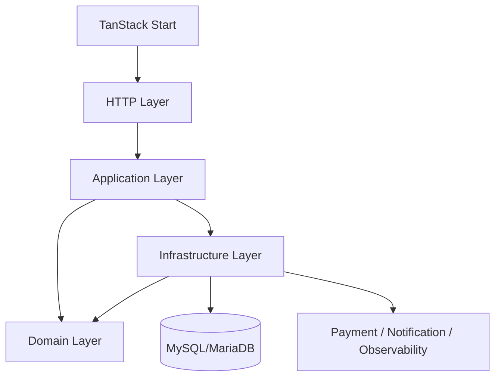
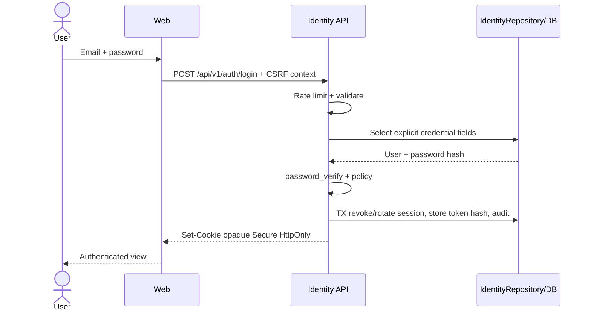
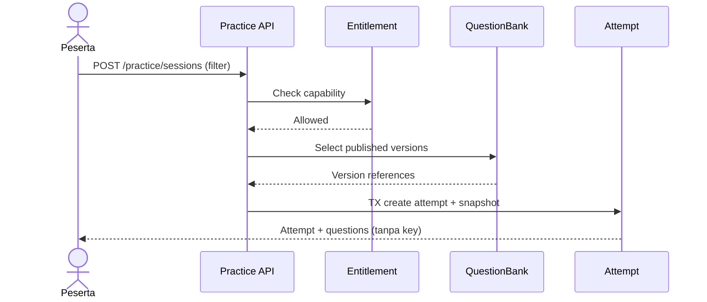
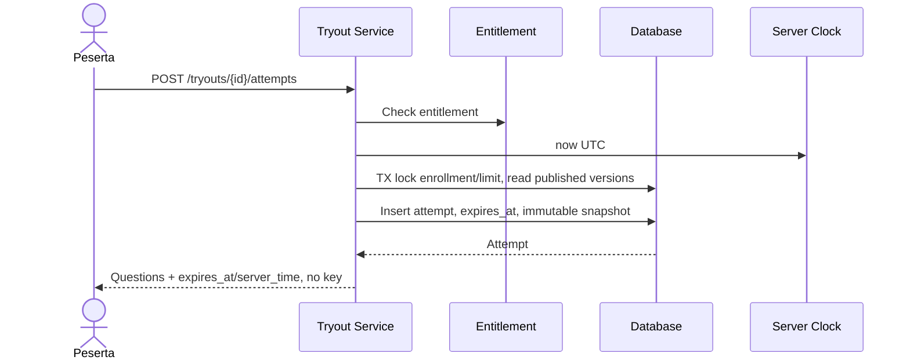
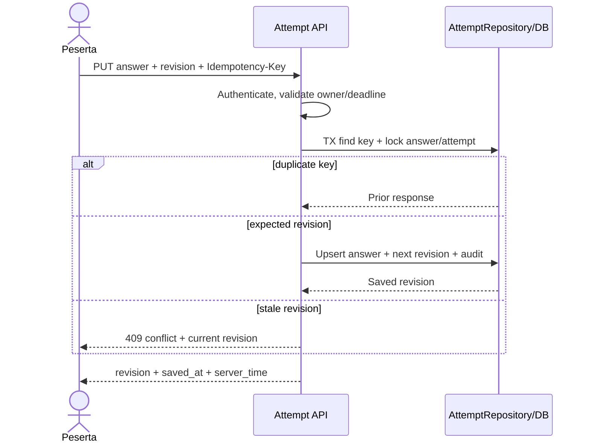
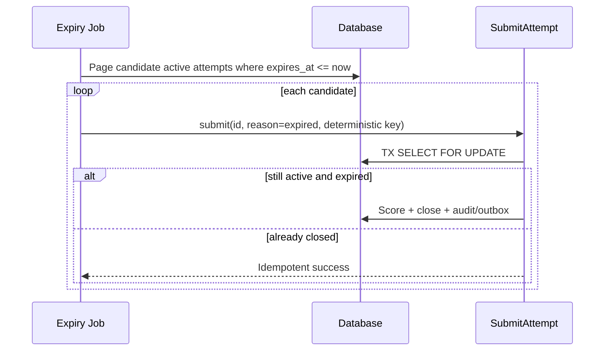
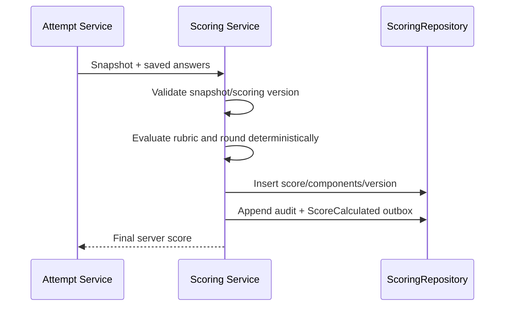
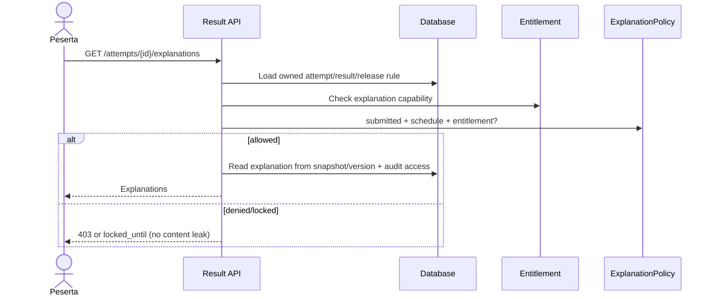

# Arsitektur SINAESTA

**Status:** Accepted baseline
**Tanggal:** 6 Agustus 2026
**Gaya:** Modular monolith, native PHP REST API

> Arsitektur ini mengikuti arahan proyek pembelajaran, tetapi implementasi bisnis
> tetap menunggu PRD disetujui dan documentation gate terpenuhi. Jika kebutuhan
> produk berubah, PRD diperbarui dahulu lalu keputusan di sini diubah melalui ADR.

## 1. Prinsip dan konteks

SINAESTA memakai frontend TanStack Start dan satu deployable backend native PHP.
Backend dibagi menjadi modul domain dengan batas kepemilikan tegas, satu database
MySQL/MariaDB, dan worker untuk pekerjaan asinkron. Monolith tidak berarti kode
tanpa batas: domain tidak membaca tabel domain lain langsung dan berkomunikasi
melalui Application Service/public interface atau domain event/outbox.

OpenAPI adalah sumber kontrak API, migration sumber schema, dan backend sumber
authorization, scoring, entitlement, timer, serta status pembayaran. Dependency
direction selalu menuju domain: HTTP dan Infrastructure bergantung pada
Application/Domain; Domain tidak bergantung pada HTTP, PDO, vendor, atau framework.



## 2. Layer dan struktur request

| Layer | Tanggung jawab | Tidak boleh |
| --- | --- | --- |
| HTTP | Router, middleware auth/CSRF/rate-limit, controller, request/response/resource | SQL, scoring, atau keputusan domain |
| Application | Use case/service, transaction boundary, orchestration, DTO, policy invocation, event/outbox | Bergantung pada detail transport |
| Domain | Entity, aggregate, value object, invariant, domain service/event, repository interface | Bergantung pada PDO/provider/frontend |
| Infrastructure | PDO repository, migration, clock/UUID, queue, provider adapter, logs | Mengubah aturan bisnis diam-diam |

Alur request normatif:

```text
HTTP Request
→ Router
→ Middleware
→ Controller
→ Validator
→ Service
→ Repository
→ PDO
→ Resource Transformer
→ JSON Response
```

Validator memvalidasi bentuk dan constraint use case. Service mengotorisasi lagi
berdasarkan principal dan resource, membuka transaksi bila perlu, menjalankan
invariant, serta menulis audit/outbox. Repository memakai query eksplisit dan PDO
prepared statement. Transformer melakukan allowlist field agar secret, answer key,
dan internal ID tidak bocor. Error mengikuti envelope proyek dan setiap respons
memiliki request ID.

## 3. Struktur kode yang dituju

```text
apps/
  web/                         # TanStack Start
  api/
    public/index.php           # front controller
    src/
      Shared/{Http,Application,Domain,Infrastructure}/
      Identity/{Http,Application,Domain,Infrastructure}/
      ... satu direktori untuk setiap domain ...
    config/
    migrations/
    tests/{Unit,Integration}/
openapi/openapi.yaml
```

Bootstrap manual/Composer menyusun dependency injection tanpa framework backend.
Controller tipis; repository interface berada di Domain/Application dan adapter
PDO di Infrastructure. Cross-domain foreign key boleh menjaga integritas, tetapi
akses tulis tetap melalui pemilik domain.

## 4. Katalog domain dan artefak wajib

Setiap baris menetapkan minimal satu entity, value object (VO), controller,
validator, service, repository, policy/authorization, event, job, endpoint, unit
test, dan integration test. Nama endpoint menggunakan prefix `/api/v1`.

| Domain | Entity & VO | HTTP: controller & validator | Service & repository | Policy/authorization | Event & job | Endpoint utama | Unit test | Integration test |
| --- | --- | --- | --- | --- | --- | --- | --- | --- |
| **Identity** | `User`, `Session`; `Email`, `PasswordHash`, `SessionTokenHash` | `AuthController`; `RegisterValidator`, `LoginValidator` | `RegisterUser`, `AuthenticateUser`, `IdentityRepository` | Pemilik session; admin tidak dapat membaca credential | `UserRegistered`; `SendVerificationEmailJob`, `PurgeExpiredSessionsJob` | `POST /auth/register`, `/auth/login`, `/auth/logout` | hash/normalisasi/rotasi session | register-login-logout, rate limit, CSRF |
| **Profile** | `Profile`; `DisplayName`, `Timezone` | `ProfileController`; `UpdateProfileValidator` | `UpdateProfile`, `ProfileRepository` | user hanya profil sendiri; admin scope eksplisit | `ProfileUpdated`; `ExportProfileJob` | `GET/PATCH /me/profile` | validasi timezone/name | ownership dan persistence profile |
| **QuestionBank** | `Question`, `QuestionVersion`, `Review`; `QuestionId`, `VersionNumber`, `PublicationStatus` | `QuestionController`, `ReviewController`; `QuestionValidator`, `ReviewValidator` | `DraftQuestion`, `ReviewQuestion`, `PublishQuestion`, `QuestionRepository` | author edit draf sendiri; reviewer berbeda; admin publish | `QuestionPublished`; `IndexPublishedQuestionJob` | `/admin/questions`, `/admin/questions/{id}/reviews`, `/admin/questions/{id}/publish` | transisi state/version immutable | workflow review, concurrent publish, snapshot |
| **Practice** | `PracticeSession`; `PracticeMode`, `TopicFilter` | `PracticeController`; `StartPracticeValidator` | `StartPractice`, `PracticeRepository` | participant + entitlement/topik | `PracticeStarted`; `PreparePracticeSetJob` | `POST /practice/sessions` | seleksi soal dan aturan mode | start tanpa answer key, entitlement denial |
| **Quiz** | `Quiz`; `QuizWindow`, `AttemptLimit` | `QuizController`; `StartQuizValidator` | `StartQuiz`, `QuizRepository` | published, jadwal, participant, limit | `QuizStarted`; `OpenQuizWindowJob` | `GET /quizzes`, `POST /quizzes/{id}/attempts` | window/limit | start quiz snapshot dan denial |
| **Tryout** | `Tryout`; `ServerDeadline`, `TryoutSchedule` | `TryoutController`; `StartTryoutValidator` | `StartTryout`, `TryoutRepository` | enrollment, entitlement, window, limit | `TryoutStarted`; `AutoSubmitExpiredAttemptsJob` | `GET /tryouts`, `POST /tryouts/{id}/attempts` | deadline dari Clock server | concurrency start dan expiry |
| **Attempt** | `Attempt`, `Answer`; `AttemptStatus`, `AnswerRevision`, `IdempotencyKey` | `AttemptController`; `SaveAnswerValidator`, `SubmitAttemptValidator` | `SaveAnswer`, `RestoreAttempt`, `SubmitAttempt`, `AttemptRepository` | pemilik; aktif; deadline; snapshot membership | `AnswerSaved`, `AttemptSubmitted`; `RecoverStaleAttemptJob` | `PUT /attempts/{id}/answers/{questionId}`, `GET /attempts/{id}`, `POST /attempts/{id}/submit` | state machine/revision/idempotency | autosave conflict, row-lock submit/restore |
| **Scoring** | `Score`, `ScoreComponent`; `ScoreValue`, `ScoringVersion` | `ResultController`; `ResultQueryValidator` | `CalculateScore`, `ScoringRepository` | hasil milik user/admin scope; hanya server menghitung | `ScoreCalculated`; `RecalculateScoreJob` (approval/audit wajib) | `GET /attempts/{id}/result` | rubric, pembulatan, determinisme | score snapshot server dan no client override |
| **Analytics** | `LearningMetric`; `MetricPeriod`, `AggregationKey` | `AnalyticsController`; `AnalyticsQueryValidator` | `BuildAnalytics`, `AnalyticsRepository` | user agregat sendiri; admin data teragregasi | `MetricRecorded`; `AggregateDailyMetricsJob` | `GET /me/analytics`, `GET /admin/analytics` | agregasi/privacy threshold | pagination, role dan isolasi user |
| **Subscription** | `Subscription`; `SubscriptionPeriod`, `SubscriptionStatus` | `SubscriptionController`; `SubscriptionQueryValidator` | `ActivateSubscription`, `ExpireSubscription`, `SubscriptionRepository` | user melihat sendiri; service account mengubah | `SubscriptionActivated`, `SubscriptionExpired`; `ExpireSubscriptionsJob` | `GET /me/subscriptions` | transition/expiry UTC | activation dan expiry idempoten |
| **Entitlement** | `Entitlement`; `Capability`, `ValidityPeriod` | `EntitlementController`; `EntitlementQueryValidator` | `GrantEntitlement`, `CheckEntitlement`, `EntitlementRepository` | database-driven, subject/resource/time | `EntitlementGranted`, `EntitlementRevoked`; `ExpireEntitlementsJob` | `GET /me/entitlements` | capability/period evaluation | paid grant, expiration, access denial |
| **Payment** | `Payment`, `PaymentEvent`; `Money`, `Currency`, `ProviderReference` | `PaymentController`, `PaymentWebhookController`; `CreatePaymentValidator`, `WebhookValidator` | `CreatePayment`, `ProcessWebhook`, `PaymentRepository` | owner reads; signed provider writes; operator scoped | `PaymentCreated`, `PaymentSettled`; `ReconcilePaymentJob` | `POST /payments`, `GET /payments/{id}`, `POST /webhooks/payments/{provider}` | state machine, signature, amount | duplicate/out-of-order webhook + row lock |
| **Voucher** | `Voucher`, `Redemption`; `VoucherCode`, `Discount` | `VoucherController`; `RedeemVoucherValidator` | `ValidateVoucher`, `RedeemVoucher`, `VoucherRepository` | participant redeem; admin manage; usage limit | `VoucherRedeemed`; `ExpireVouchersJob` | `POST /vouchers/validate`, `/admin/vouchers` | discount/limit/window | concurrent redemption and server total |
| **Notification** | `Notification`; `Channel`, `DeliveryStatus` | `NotificationController`; `NotificationPreferenceValidator` | `QueueNotification`, `NotificationRepository` | recipient own notifications/preferences | `NotificationQueued`; `DeliverNotificationJob` | `GET /me/notifications`, `PATCH /me/notification-preferences` | template allowlist/preferences | outbox delivery/retry/redaction |
| **Administration** | `AdminAction`; `AdminReason`, `ApprovalState` | `AdminController`; `AdminActionValidator` | `ExecuteAdminAction`, `AdministrationRepository` | RBAC + object scope + step-up/four-eyes | `AdminActionExecuted`; `ReviewPendingAdminActionJob` | `/admin/users`, `/admin/packages`, `/admin/payments` | role/scope/four-eyes | forbidden matrix dan audited operation |
| **Audit** | `AuditEntry`; `Actor`, `Action`, `ResourceRef` | `AuditController`; `AuditQueryValidator` | `AppendAudit`, `AuditRepository` | append internal; read auditor with filters; immutable | `SecurityEventRaised`; `ArchiveAuditJob` | `GET /admin/audit-logs` | redaction/immutability | important action recorded, no secret, pagination |
| **SystemHealth** | `HealthCheck`; `HealthStatus`, `ComponentName` | `HealthController`; `HealthQueryValidator` | `CheckHealth`, `HealthRepository` | liveness public minimal; readiness internal/protected | `ServiceDegraded`; `HealthProbeJob` | `GET /health/live`, `GET /health/ready` | status aggregation/no details leak | DB readiness, public response safety |

Endpoint detail, schemas, error, security scheme, pagination, dan idempotency header
harus didefinisikan di OpenAPI sebelum implementasi. Endpoint admin di tabel adalah
kelompok resource, bukan izin wildcard.

## 5. Konsistensi, keamanan, dan operasi

- Transaction melingkupi aggregate dan outbox yang harus atomik. Integrasi jaringan
  tidak ditahan dalam transaction DB; gunakan state machine/outbox/reconciliation.
- Submit attempt dan webhook mengunci row target, memeriksa state setelah lock, dan
  memiliki unique constraint untuk idempotency/event provider.
- Waktu berasal dari injectable server `Clock`; UUID/ULID dari generator aman.
- Snapshot menyimpan urutan, versi soal, opsi/rubrik/answer key yang diperlukan
  scoring. Resource aktif menghapus answer key/pembahasan dari respons.
- Query memakai PDO prepared statements, daftar kolom eksplisit, pagination, index,
  batas hasil, dan transaksi dengan isolation level terdokumentasi.
- Session token opaque hanya muncul di cookie; database menyimpan hash. Password
  memakai `password_hash`/`password_verify` dan rehash saat kebijakan berubah.
- Log terstruktur mencakup request/correlation ID dan event bisnis tanpa secret,
  credential, answer key aktif, atau PII berlebih.

# Architecture Decision Records

Status yang digunakan: **Proposed**, **Accepted**, **Deprecated**, **Superseded**.
Seluruh ADR berikut berstatus **Accepted** sebagai baseline, dengan validasi produk
tetap mengikuti gate PRD.

## ADR-001 — TanStack Start frontend

- **Context:** Dibutuhkan web type-safe, routing modern, SSR publik, dan integrasi
  query tanpa memindahkan aturan bisnis ke klien.
- **Decision:** Gunakan TanStack Start untuk aplikasi web; frontend mengonsumsi
  REST `/api/v1` dan tidak menghitung scoring/entitlement/payment status.
- **Alternatives:** React SPA/Vite, Next.js, server-rendered PHP.
- **Consequences:** Routing dan SSR terpadu; tim harus mengelola runtime Node serta
  pemisahan state server/client.
- **Risks:** Ekosistem lebih muda/perubahan API; mitigasi dengan versi terkunci,
  test build/SSR, dan adapter tipis.
- **Status:** Accepted.

## ADR-002 — Native PHP REST API

- **Context:** Backend PHP dibutuhkan dan framework PHP dilarang.
- **Decision:** Bangun front controller, router, middleware, controller, DI, dan
  error handler native PHP dengan library kecil yang diaudit bila perlu.
- **Alternatives:** Laravel/Symfony, Node service, Go service.
- **Consequences:** Kontrol/dependensi minimal, tetapi plumbing dan disiplin test
  menjadi tanggung jawab tim.
- **Risks:** Membuat framework internal atau kontrol keamanan tidak lengkap;
  mitigasi dengan komponen kecil, standar PSR, threat review, dan integration test.
- **Status:** Accepted.

## ADR-003 — MySQL atau MariaDB

- **Context:** Data relasional membutuhkan transaction, constraint, locking, dan
  operasi yang umum tersedia.
- **Decision:** Gunakan satu versi MySQL **atau** MariaDB yang dipilih sebelum kode,
  dikunci sama di semua environment; SQL mengikuti kemampuan versi tersebut.
- **Alternatives:** PostgreSQL, SQLite, document database.
- **Consequences:** Konsistensi ACID dan operasi matang; pemilihan vendor final
  perlu compatibility spike untuk JSON, collation, locking, dan migration.
- **Risks:** Perbedaan MySQL/MariaDB dan lock contention; jangan menjanjikan
  portabilitas semu, uji query/concurrency pada engine produksi.
- **Status:** Accepted.

## ADR-004 — PDO prepared statements

- **Context:** Query dinamis rawan SQL injection dan butuh akses database standar.
- **Decision:** Semua akses SQL melalui PDO prepared statements, emulated prepares
  nonaktif bila driver mendukung, binding bertipe, dan allowlist untuk identifier.
- **Alternatives:** ORM, mysqli, concatenated SQL.
- **Consequences:** SQL eksplisit dan aman untuk value; mapping/repository ditulis
  manual.
- **Risks:** Identifier tidak dapat di-bind dan query N+1; mitigasi allowlist,
  review query, index, profiling, serta integration test.
- **Status:** Accepted.

## ADR-005 — Opaque session authentication

- **Context:** Web first-party perlu revocation cepat tanpa menyimpan claims lama di
  browser atau access token mentah di database.
- **Decision:** Gunakan random opaque session token dalam secure HttpOnly cookie;
  simpan hash, expiry, user/device metadata minimum, rotasi login/privilege change,
  CSRF defense, dan revoke server-side.
- **Alternatives:** JWT access token, OAuth-only, PHP default session state.
- **Consequences:** Revocation/authorization mutakhir; setiap request membutuhkan
  lookup/cache terkontrol.
- **Risks:** Session fixation/theft dan DB load; mitigasi entropy kuat, rotasi,
  cookie flags, rate limit, hash, expiry, index, dan anomaly audit.
- **Status:** Accepted.

## ADR-006 — Server-side scoring

- **Context:** Skor menentukan hasil dan mungkin hak akses; klien tidak tepercaya.
- **Decision:** Backend menghitung dan menyimpan semua skor dari snapshot/rubric
  berversi; frontend hanya menampilkan.
- **Alternatives:** Scoring browser, hybrid verification, provider eksternal.
- **Consequences:** Hasil konsisten/auditable dan answer key terlindungi; beban
  komputasi berada di backend.
- **Risks:** Bug berdampak luas; simpan algorithm version, golden tests, audit, dan
  proses recalculation berotorisasi.
- **Status:** Accepted.

## ADR-007 — Server-side timer

- **Context:** Jam/tab browser dapat dimanipulasi, tidur, atau offline.
- **Decision:** Simpan `started_at`/`expires_at` UTC dari server Clock. Backend
  memvalidasi setiap mutasi dan job meng-auto-submit attempt expired.
- **Alternatives:** Timer browser, signed client timer, proctor-only timer.
- **Consequences:** Deadline otoritatif; UI countdown tetap hanya indikator dan
  harus rekonsiliasi server time.
- **Risks:** Clock skew/job delay/race; NTP monitoring, row lock, idempotent submit,
  dan expiry check inline.
- **Status:** Accepted.

## ADR-008 — Question snapshot

- **Context:** Perubahan soal setelah attempt dimulai tidak boleh mengubah konten
  atau hasil historis.
- **Decision:** Saat start, bekukan reference/version, urutan, opsi, rubric dan key
  untuk scoring sebagai snapshot immutable; respons aktif menyaring key.
- **Alternatives:** Selalu baca versi terbaru, copy seluruh soal tanpa version,
  melarang semua perubahan global.
- **Consequences:** Reproducible scoring dan audit; storage serta migration snapshot
  bertambah.
- **Risks:** Kebocoran key dan snapshot tidak lengkap; field allowlist, encryption/
  access control, schema/version test.
- **Status:** Accepted.

## ADR-009 — Database-driven entitlement

- **Context:** Akses paket harus konsisten, dapat dicabut/expired, dan bukan claims
  frontend/session yang basi.
- **Decision:** Simpan grant entitlement dengan capability, subject, source, serta
  validity period; policy backend mengecek database pada aksi terlindungi.
- **Alternatives:** Flag user, claims JWT, cek payment langsung.
- **Consequences:** Fleksibel dan auditable; perlu indeks/cache invalidation aman.
- **Risks:** Hot query atau stale cache; index, short cache keyed version, revoke
  invalidation, dan fail closed.
- **Status:** Accepted.

## ADR-010 — Idempotent payment webhook

- **Context:** Provider dapat retry, menduplikasi, mengacak urutan, atau memalsukan
  request bila signature tidak diverifikasi.
- **Decision:** Verifikasi raw-body signature/timestamp, unique provider event ID,
  lock payment, validasi transition/amount/currency, dan atomikkan event, payment,
  entitlement, audit/outbox. Duplikat valid mengembalikan 2xx tanpa efek ulang.
- **Alternatives:** Proses setiap webhook, percaya redirect, polling saja.
- **Consequences:** Retry aman dan entitlement tepat sekali secara efektif; handler
  serta reconciliation lebih kompleks.
- **Risks:** Provider tanpa event ID/out-of-order; gunakan hash kanonis/reference,
  state machine, inbox, retention, dan reconciliation job.
- **Status:** Accepted.

## ADR-011 — Modular monolith

- **Context:** Banyak domain membutuhkan batas jelas tanpa biaya operasional
  microservices pada tahap awal.
- **Decision:** Satu deployable PHP dan satu database, dipisah modul/layer dengan
  ownership, interface, serta event internal/outbox.
- **Alternatives:** Monolith berlapis global, microservices, serverless functions.
- **Consequences:** Transaction/deploy sederhana dan refactor cepat; scaling serta
  release masih bersama.
- **Risks:** Coupling dan “big ball of mud”; architecture tests, module ownership,
  larangan cross-repository/table, dan ADR sebelum menembus batas.
- **Status:** Accepted.

## ADR-012 — API versioning

- **Context:** Frontend dan integrasi perlu kontrak stabil saat backend berubah.
- **Decision:** URL major version `/api/v1`; OpenAPI kanonis. Perubahan kompatibel
  tetap v1, breaking change membutuhkan v2 dan deprecation/sunset terukur.
- **Alternatives:** Header/media-type versioning, tanpa versi, version per endpoint.
- **Consequences:** Mudah dipahami/cache/debug; beberapa major mungkin hidup
  bersamaan.
- **Risks:** Drift/maintenance ganda; contract tests, generated types, telemetry,
  owner dan batas sunset.
- **Status:** Accepted.

## ADR-013 — Audit logging

- **Context:** Publikasi, auth, score, role, payment, voucher, dan entitlement harus
  dapat ditelusuri tanpa bergantung pada application log yang mudah berotasi.
- **Decision:** Tulis audit append-only berisi actor/action/resource/time UTC,
  outcome, reason, correlation ID, serta diff aman; atomik/outbox dengan aksi.
- **Alternatives:** Application log saja, database binlog, provider SIEM saja.
- **Consequences:** Investigasi/compliance lebih baik; storage, retensi, dan akses
  perlu dikelola.
- **Risks:** PII/secret bocor atau tampering; allowlist/redaction, least privilege,
  integrity control, archival, monitoring dan audit atas pembacaan.
- **Status:** Accepted.

## ADR-014 — SSR untuk halaman publik

- **Context:** Halaman publik membutuhkan first render cepat, metadata, dan
  discoverability; area attempt sangat interaktif dan privat.
- **Decision:** Render halaman publik dengan SSR TanStack Start lalu hydrate;
  dashboard/attempt boleh client-interactive. Jangan menaruh data privat dalam
  cache publik atau HTML lintas pengguna.
- **Alternatives:** SPA penuh, static-only generation, PHP templates.
- **Consequences:** SEO/perceived performance membaik; runtime dan caching SSR
  bertambah kompleks.
- **Risks:** Hydration mismatch/data leak/cache poisoning; per-request context,
  cache-control eksplisit, escaping, CSP, dan SSR tests.
- **Status:** Accepted.

## ADR-015 — TanStack Query untuk server state

- **Context:** Frontend membutuhkan fetching, cache, retry, invalidation, dan
  hydration konsisten tanpa menduplikasi state backend.
- **Decision:** Gunakan TanStack Query untuk server state. Query key terstruktur;
  mutation membawa idempotency/revision; invalidasi setelah sukses. Jangan cache
  answer key/secret atau menganggap cache otoritatif.
- **Alternatives:** Fetch manual, Redux untuk semua state, loader-only state.
- **Consequences:** Boilerplate dan request duplikat berkurang; tim perlu kebijakan
  stale time, retry, hydration, serta error yang konsisten.
- **Risks:** Data privat tersisa/cache stale/retry mutation; cache per session,
  clear saat logout, retry mutation hanya bila idempoten, dan server revalidation.
- **Status:** Accepted.

# Sequence Diagrams

Diagram menyederhanakan error response, tetapi semua request melewati middleware,
authorization, validation, audit, dan observability yang relevan.

## Login



## Start practice



## Start tryout



## Save answer



## Restore attempt

```mermaid
sequenceDiagram
  actor U as Peserta
  participant A as Attempt API
  participant DB as Database
  participant C as Server Clock
  U->>A: GET /attempts/{id}
  A->>DB: Load explicit attempt/snapshot/answers by owner
  A->>C: now UTC
  A->>A: Derive active/expired; trigger submit if expired
  A-->>U: State + saved answers + deadline/server_time, no key
```

## Submit attempt

```mermaid
sequenceDiagram
  actor U as Peserta
  participant A as SubmitAttempt
  participant DB as Database
  participant S as Scoring
  U->>A: POST /attempts/{id}/submit + key
  A->>DB: BEGIN; SELECT attempt FOR UPDATE
  A->>A: Owner + state + server deadline
  alt already submitted / duplicate
    DB-->>A: Existing result
  else active
    A->>DB: Mark submitting, load snapshot + answers
    A->>S: Calculate(snapshot, answers)
    S-->>A: Score + algorithm version
    A->>DB: Save result, submitted, audit + outbox; COMMIT
  end
  A-->>U: Stable result reference
```

## Auto-submit expired attempt



## Calculate score



## Unlock explanation



## Create payment

```mermaid
sequenceDiagram
  actor U as Peserta
  participant P as Payment Service
  participant DB as Database
  participant PP as Provider
  U->>P: POST /payments (package_id, voucher, key)
  P->>DB: Read active package price; validate voucher
  P->>DB: TX create pending payment with server total
  P->>PP: Create checkout(amount, currency, reference)
  PP-->>P: Checkout reference + URL
  P->>DB: Save provider reference
  P-->>U: Checkout URL (not paid status)
```

## Process webhook

```mermaid
sequenceDiagram
  participant PP as Provider
  participant W as Webhook API
  participant DB as Database
  PP->>W: Raw body + signature + timestamp
  W->>W: Verify signature, freshness, schema
  W->>DB: BEGIN; insert inbox event unique
  alt duplicate valid event
    W->>DB: ROLLBACK/no-op
    W-->>PP: 2xx
  else new event
    W->>DB: SELECT payment FOR UPDATE
    W->>W: Verify reference/amount/currency/transition
    W->>DB: Update payment + audit + outbox; COMMIT
    W-->>PP: 2xx
  end
```

## Activate entitlement

```mermaid
sequenceDiagram
  participant O as Outbox Worker
  participant S as Subscription Service
  participant E as Entitlement Service
  participant DB as Database
  O->>S: PaymentSettled(payment_id)
  S->>DB: BEGIN; lock payment/subscription source
  S->>DB: Create subscription if absent
  S->>E: Grant capabilities for validity period
  E->>DB: Upsert deterministic grants
  S->>DB: Audit + notification outbox; COMMIT
  S-->>O: Idempotent success
```

## Expire subscription

```mermaid
sequenceDiagram
  participant J as Expiry Job
  participant C as Server Clock
  participant DB as Database
  participant E as Entitlement Service
  J->>C: now UTC
  J->>DB: Page active subscriptions ended before now
  loop each subscription
    J->>DB: TX lock subscription
    J->>DB: Mark expired if still due
    J->>E: Revoke/expire linked entitlement
    J->>DB: Audit + SubscriptionExpired outbox; COMMIT
  end
```
